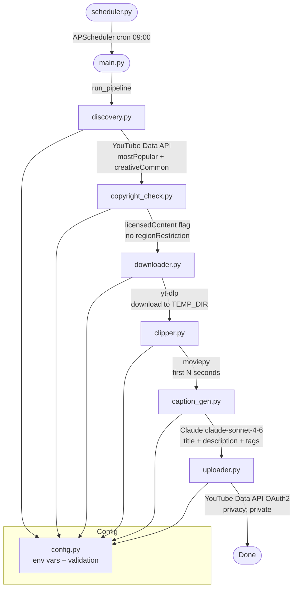

# Architecture

## Pipeline Flow



## Module Responsibilities

| Module | Input | Output | External dependency |
|---|---|---|---|
| `discovery.py` | — | `list[dict]` video candidates | YouTube Data API v3 |
| `copyright_check.py` | `list[dict]` | filtered `list[dict]` | YouTube Data API v3 |
| `downloader.py` | `dict` (video) | local file path | yt-dlp |
| `clipper.py` | file path, video_id | clip file path | moviepy |
| `caption_gen.py` | `dict` (video) | `dict` with title/description/tags | Anthropic API |
| `uploader.py` | clip path, metadata dict | — | YouTube Data API v3 OAuth2 |
| `scheduler.py` | — | — | APScheduler |
| `config.py` | `.env` file | typed config constants | python-dotenv |

## Data shape (passed between stages)

```python
{
    "video_id":    str,   # YouTube video ID
    "title":       str,   # original video title
    "description": str,   # original description
    "channel":     str,   # channel name
    "url":         str,   # full YouTube URL
}
```
